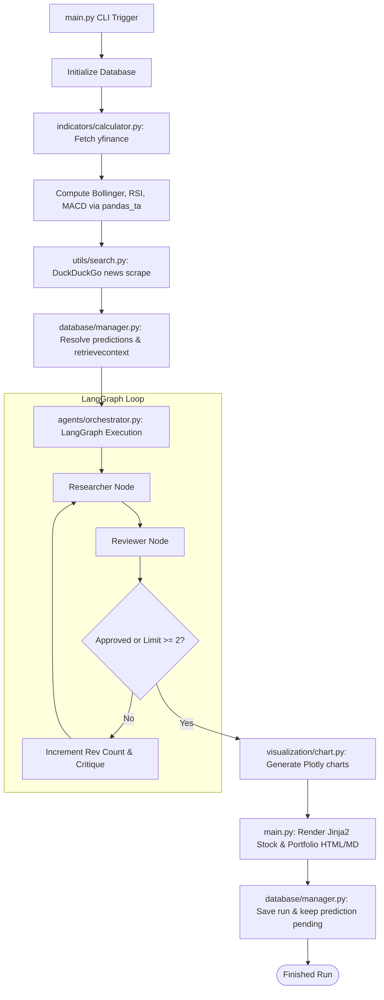
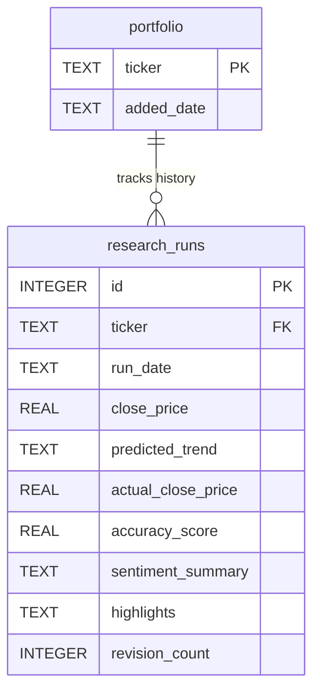

# LocalAlpha System Architecture

This document describes the high-level architecture, execution lifecycle, database design, and algorithmic details of LocalAlpha.

---

## 1. High-Level System Architecture

LocalAlpha divides processing into three sequential layers: **Quantitative Data Ingestion & Scoring**, **Agentic Decision Graph**, and **Presentation Compilation**.

---

## 2. End-to-End Execution Lifecycle

When a run is executed (e.g. `python main.py --ticker AAPL`), the system completes the following phases:

1. **Schema Verification & Database Setup:** The SQLite connection creates the `research_runs` and `portfolio` tables if they do not exist.
2. **Prediction Resolution Loop:** The database manager searches for previous runs of `AAPL` where `actual_close_price` is `NULL`. If found, it downloads historical prices from `yfinance` to locate the first trading close *strictly after* that prediction's `run_date` and evaluates its accuracy.
3. **Context Ingestion:** The system retrieves the rolling accuracy score and highlights from the latest completed run, downloads 60 days of market price records, computes technical indicators, and scrapes news headlines.
4. **Agent Graph Orchestration:** LangGraph compiles a state machine containing technical metrics, search results, and database contexts. The Researcher drafts a trend report which the Reviewer verifies for mathematical accuracy.
5. **Plotly Chart Compilation:** The candlestick overlaid with Bollinger Bands, RSI line, and MACD lines/histograms are compiled as raw interactive HTML divs with X-axis date synchronization.
6. **Report Generation:** Individual stock pages and consolidated portfolio dashboard sheets are compiled using CSS styles and written as files to the `reports/` folder.
7. **Execution Logging:** The final approved trend output, close price, highlights, and revision logs are stored in the SQLite database to await evaluation in the next run.

---

## 3. SQLite Database Design & Schema

The application uses SQLite as a persistent state layer to retain historical records across execution cron schedules.

### Table 1: `portfolio`
Stores the active list of stock symbols tracked by the user:
* `ticker` (TEXT, PRIMARY KEY): Capitalized ticker symbol (e.g. `AAPL`).
* `added_date` (TEXT): ISO timestamp when the ticker was added.

### Table 2: `research_runs`
Stores the log of all sequential research analyses and trend predictions:
* `id` (INTEGER, PRIMARY KEY AUTOINCREMENT): Unique run identifier.
* `ticker` (TEXT, NOT NULL): The analyzed stock ticker.
* `run_date` (TEXT, NOT NULL): Date of the analysis (`YYYY-MM-DD`).
* `close_price` (REAL, NOT NULL): Closing stock price on `run_date` (used as baseline).
* `predicted_trend` (TEXT, NOT NULL): Trend output from LangGraph (`Bullish`, `Bearish`, or `Neutral`).
* `actual_close_price` (REAL): The next trading day's closing price (filled on subsequent runs).
* `accuracy_score` (REAL): Evaluated direction score: `1.0` (correct), `0.0` (incorrect), `0.5` (neutral).
* `sentiment_summary` (TEXT, NOT NULL): Summary of broader news sentiment.
* `highlights` (TEXT, NOT NULL): Final approved agent text highlights and report.
* `revision_count` (INTEGER, NOT NULL): Revisions executed in the graph (min `0`, max `2`).

---

## 4. Prediction Accuracy Evaluation Loop

The mathematical scoring logic evaluates qualitative forecasts against physical price movements:

$$\text{Accuracy Score} = \begin{cases} 
1.0 & \text{if } \text{predicted\_trend} = \text{"Bullish"} \text{ and } \text{actual\_close\_price} > \text{close\_price} \\
1.0 & \text{if } \text{predicted\_trend} = \text{"Bearish"} \text{ and } \text{actual\_close\_price} < \text{close\_price} \\
0.5 & \text{if } \text{predicted\_trend} = \text{"Neutral"} \text{ or } \text{actual\_close\_price} = \text{close\_price} \\
0.0 & \text{otherwise}
\end{cases}$$

The rolling average of the last $N$ (default is 5) completed runs' accuracy scores is retrieved:

$$\text{Rolling Accuracy} = \frac{\sum_{i=1}^{k} \text{accuracy\_score}_i}{k} \quad (\text{where } k \le 5)$$

This rolling score is injected into the LLM system prompt on subsequent runs. This gives the agents a statistical reminder of their forecasting success for that ticker, forcing more cautious predictions during periods of low accuracy.
